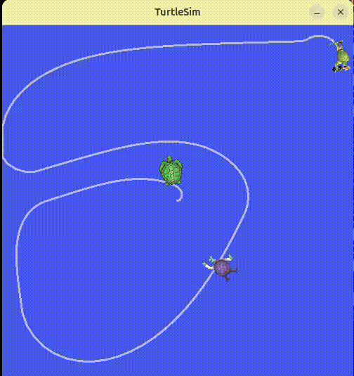

# 🐢 Turtlesim – **Catch Them All!** (ROS 2 Project)

  

## 📌 Overview
This project is a complete ROS 2 application built around the **Turtlesim** simulator.  
The goal is simple: **control the main turtle (“turtle1”) and automatically chase & catch randomly-spawning turtles**.

The project demonstrates core ROS 2 concepts including:
- Node communication
- Publishers/subscribers
- Services and custom interfaces
- Timers and control loops
- Parameters and launch files
- Integration with the Turtlesim simulator

---

## 🚀 Features

### **1. Turtle Spawner Node (`turtle_spawner`)**
- Spawns turtles at random coordinates using the `/spawn` service.
- Publishes all currently alive turtles to `/alive_turtles`.
- Hosts the custom service `/catch_turtle` which removes a turtle by calling `/kill`.
- Supports parameters:
  - `spawn_frequency`
  - `turtle_name_prefix`

### **2. Autonomous Turtle Controller Node (`turtle_controller`)**
- Controls **turtle1** using a simple P-controller.
- Subscribes to `/turtle1/pose` and publishes velocity commands to `/turtle1/cmd_vel`.
- Reads `/alive_turtles` to determine which turtle to chase.
- Strategy can be:
  - Catch the first turtle in the list  
  - Catch the closest turtle (parameter configurable)
- Calls `/catch_turtle` when the target turtle is reached.

### **3. Custom ROS 2 Interfaces**
Created in a separate interface package (e.g., `my_robot_interfaces`):

| Interface | Description |
|----------|-------------|
| `Turtle.msg` | Holds (name, x, y) |
| `TurtleArray.msg` | Array of turtles currently alive |
| `CatchTurtle.srv` | Sends the name of a caught turtle |

### **4. Launch + Parameterization**
A bringup package starts:
- `turtlesim_node`
- `turtle_spawner`
- `turtle_controller`

Parameters are loaded via YAML for easy behavior tuning.

---

## 🧩 System Architecture

Three ROS 2 nodes form the application:

- **turtlesim_node** — built-in simulator  
- **turtle_spawner** — spawns & manages turtles  
- **turtle_controller** — moves turtle1 and catches targets  

They communicate using:

**Topics**
- `/turtle1/pose`
- `/turtle1/cmd_vel`
- `/alive_turtles`

**Services**
- `/spawn` (Turtlesim default)
- `/kill` (Turtlesim default)
- `/catch_turtle` (custom)

---

